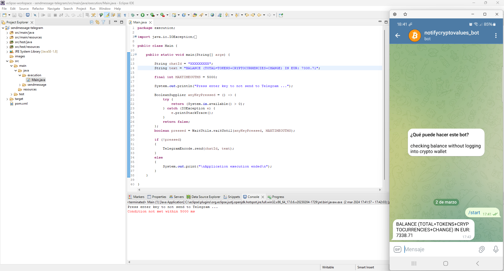

# sendmessage-telegram

How to use Java to send Telegram messages automatically

## Application context

For sending yourself notifications from an application there are many different ways, from sending emails to phone notifications. Using a chat platform like Telegram is an easy way to get updates and notifications on multiple devices. This source code shows you how to send a Telegram message in Java.

## Implementation

Basically, I create 4 Java files.

In:  
execution\ folder
* Main.java

In:  
sendmessage\ folder
* TelegramEncode.java
* Unit.java
* WaitUtils.java

Additionally, a pom.xml configuration file of the project is created. It is a XML file that contains information about the project and configuration details used by Maven to build the project.

## Usage

I will send a Telegram message using Java.

In:  
[sendmessage-telegram\src\main\java\sendmessage\TelegramEncode.java](src/main/java/sendmessage/TelegramEncode.java)

Edit the variable apiToken:
```
public static String send(String chatId, String text) {

	String urlString = "https://api.telegram.org/bot%s/sendMessage?chat_id=%s&text=%s";
	//Add Telegram Bot token
	String apiToken = "to complete";
```
In:  
[sendmessage-telegram\src\main\java\execution\Main.java](src/main/java/execution/Main.java)

Edit the variables chatId and text:
```
public static void main(String[] args) {

	String chatId = "to complete";
	String text = “to complete";
```

Run Main.java

The following screenshot shows the results with these variable values:
```
public static void main(String[] args) {

	String chatId = "XXXXXXXXX";
	String text = "BALANCE (TOTAL=TOKENS+CRYPTOCURRENCIES+CHANGE) IN EUR: 7338.71";
```


If you build the project with Maven a .jar extension file called sendmessage-telegram-0.0.1-SNAPSHOT-jar-with-dependencies will be generated in target\ folder.

To execute it, you could open a new terminal in target\ folder and type:
```
java -jar sendmessage-telegram-0.0.1-SNAPSHOT-jar-with-dependencies.jar
```

## Deliverable

that includes:

Java EE Eclipse project with the source code. You should use Maven build because the project is clean.

Download the files as a zip using the green button, or clone the repository to your machine using Git.
